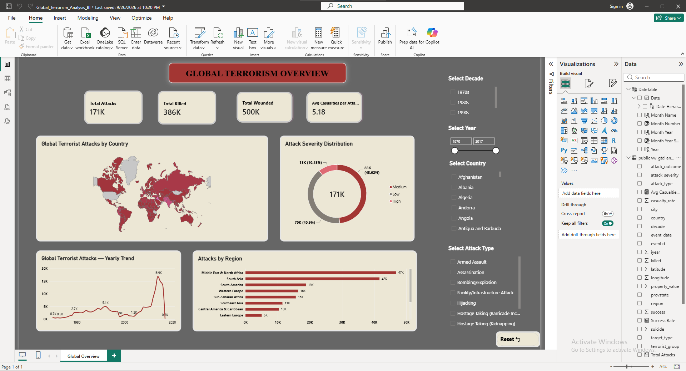

<div align="center">

# 🌍 Global Terrorism Analysis

### End-to-end analytics project on 171,055 terrorism incidents (1970–2017)


</div>

---

## 📑 Table of Contents

1. [Dashboard Preview](#-dashboard-preview)
2. [Project Overview](#-project-overview)
3. [Tech Stack](#-tech-stack)
4. [Project Structure](#-project-structure)
5. [Dataset](#-dataset)
6. [Methodology](#-methodology)
7. [Key Findings](#-key-findings)
8. [DAX Measures](#-dax-measures)
9. [Data Limitations](#-data-limitations)
10. [Future Improvements](#-future-improvements)
11. [Author](#-author)

---

## 📊 Dashboard Preview

<p align="center">
  
</p>

| KPI | Value |
| --- | ---: |
| **Total Attacks** | 171K (171,055) |
| **Total Killed** | 386K |
| **Total Wounded** | 500K |
| **Avg Casualties per Attack** | 5.18 |

**Visuals**

- 🗺️ **Global Terrorist Attacks by Country**: filled map of attack intensity
- 🍩 **Attack Severity Distribution**: Low / Medium / High
- 📈 **Yearly Trend**: attacks per year, 1970–2017
- 📊 **Attacks by Region**: ranked regional comparison

**Interactive filters:** Decade · Year range · Country · Attack Type · Reset button

---

## 📌 Project Overview

This project analyzes the **Global Terrorism Database (GTD)** to understand how terrorism incidents evolved over time and across the world. It answers questions such as:

- How did the number of incidents change over time?
- Which regions and countries recorded the most attacks?
- How severe were attacks in terms of casualties?
- How many attacks were successful vs. failed?

```text
Raw GTD CSV  →  Python Validation  →  PostgreSQL (raw)  →  SQL Cleaning
      →  Feature Engineering  →  Analysis View  →  Power BI + DAX  →  Dashboard
```

---

## 🛠️ Tech Stack

| Tool | Purpose |
| --- | --- |
|  | Data loading and validation |
|  | Data inspection and manipulation |
|  | Interactive notebook development |
|  | Database storage and analytical processing |
|  | Cleaning, transformation, feature engineering |
|  | Interactive dashboard |
|  | KPIs and analytical measures |
|  | Version control and documentation |

---

## 📂 Project Structure

```text
Global-Terrorism-Analysis/
│
├── data/
│   └── data_loading_by_python.ipynb
│
├── sql/
│   └── sql_raw.txt
│
├── powerbi/
│   ├── Global_Terrorism_Analysis_BI.pbix
│   └── screenshots/
│       └── Screenshot_power_bi.png
│
└── README.md
```

| Folder | Contents |
| --- | --- |
| [`data/`](data/) | Python notebook for loading and inspecting the GTD dataset |
| [`sql/`](sql/) | SQL workflow: raw table, cleaning, feature engineering, analysis view |
| [`powerbi/`](powerbi/) | Power BI report file and dashboard screenshot |

---

## 📁 Dataset

**Global Terrorism Database (GTD)**

| Item | Detail |
| --- | --- |
| Time period | 1970–2017 |
| Original records | 171,056 |
| Columns | 135 |
| Valid records imported | 171,055 |
| Malformed records skipped | 1 |

> **Note:** The raw GTD dataset is **not included** in this repository. Please obtain it from the official source and follow its licensing and usage terms.

---

## 🔬 Methodology

### 1. Python: Inspection & Validation
Loaded the CSV with Pandas, checked dimensions, data types, duplicates, missing values, and malformed records. See [`data/data_loading_by_python.ipynb`](data/data_loading_by_python.ipynb).

```python
import pandas as pd

gtd = pd.read_csv(
    "globalterrorismdb_0718dist.csv",
    encoding="latin1",
    low_memory=False
)
print("Rows:", gtd.shape[0], "| Columns:", gtd.shape[1])
```

### 2. PostgreSQL: Storage & Cleaning
Database: `gtd_db`. See [`sql/sql_raw.txt`](sql/sql_raw.txt).

```text
raw_gtd_events  →  gtd_clean  →  vw_gtd_analysis
```

- Imported raw data as text, then converted to proper numeric and date types
- Handled missing casualty values
- Converted invalid property values (`-99`) to `NULL`
- Built standardized event dates
- Validated event IDs, coordinates, and year ranges

### 3. Feature Engineering

| Feature | Logic |
| --- | --- |
| `total_casualties` | `killed + wounded` |
| `attack_severity` | Low = 0 casualties · Medium = 1–10 · High = more than 10 |
| `decade` | 1970s, 1980s, 1990s, 2000s, 2010s |
| `attack_outcome` | Based on success and suicide-attack indicators |

### 4. Validation Results

| Check | Result |
| --- | --- |
| Total valid rows | 171,055 |
| Duplicate event IDs | 0 |
| Duplicate rows | 0 |
| Year range | 1970–2017 |
| Missing latitude / longitude | 0 / 0 |

### 5. Power BI: Model & Dashboard
Connected to `vw_gtd_analysis` in PostgreSQL, added a dedicated `DateTable`, created DAX measures, and built the interactive **Global Overview** page.

---

## 📈 Key Findings

### Attacks by Decade

| Decade | Attacks |
| --- | ---: |
| 1970s | 9,914 |
| 1980s | 31,160 |
| 1990s | 28,762 |
| 2000s | 25,040 |
| 2010s | 76,179 |

### Attack Severity

| Severity | Attacks | Share |
| --- | ---: | ---: |
| Medium | 83,162 | 48.62% |
| Low | 69,961 | 40.90% |
| High | 17,932 | 10.48% |

### Attack Outcome

| Outcome | Attacks |
| --- | ---: |
| Successful Attack | 148,211 |
| Failed Attack | 17,021 |
| Successful Suicide Attack | 4,991 |
| Failed Suicide Attack | 832 |

### Attacks by Region (approx.)

| Region | Attacks |
| --- | ---: |
| Middle East & North Africa | ~47K |
| South Asia | ~42K |
| South America | ~19K |
| Western Europe | ~16K |
| Sub-Saharan Africa | ~16K |
| Southeast Asia | ~11K |
| Central America & Caribbean | ~10K |
| Eastern Europe | ~5K |

### 💡 Insights

- The **2010s** recorded the most incidents, with a yearly peak of roughly **16.9K attacks**.
- **Middle East & North Africa** and **South Asia** together account for over half of all recorded attacks.
- Only about **10%** of attacks are *High* severity (more than 10 casualties).
- The vast majority of recorded attacks are classified as successful.
- The average attack caused about **5.18 casualties** (killed + wounded).

---

## 📐 DAX Measures

```DAX
Total Attacks =
DISTINCTCOUNT('public vw_gtd_analysis'[eventid])

Total Killed =
SUM('public vw_gtd_analysis'[killed])

Total Wounded =
SUM('public vw_gtd_analysis'[wounded])

Total Casualties =
SUM('public vw_gtd_analysis'[total_casualties])

Avg Casualties per Attack =
DIVIDE([Total Casualties], [Total Attacks], 0)

Success Rate =
DIVIDE(
    CALCULATE([Total Attacks], 'public vw_gtd_analysis'[success] = 1),
    [Total Attacks],
    0
)
```

**Date Table:** `Date`, `Year`, `Month Number`, `Month Name`, `Month Year`, `Month Year Sort` (used to sort months chronologically).

---

## ⚠️ Data Limitations

- Some records contain unknown or missing values.
- Casualty counts may be incomplete for some events.
- Reporting practices vary across countries and years.
- The dataset version used covers 1970–2017 only.
- One malformed CSV record was excluded during import.

Results describe the **recorded dataset**, not all terrorism incidents worldwide.

---

## 🚀 Future Improvements

- [ ] Terrorist group trend analysis
- [ ] Weapon and target type analysis
- [ ] Year-over-year regional comparison
- [ ] Additional dashboard pages with drill-through
- [ ] Automated ETL pipeline
- [ ] Statistical analysis and predictive modeling in Python

---

## 👨‍💻 Author

**Sabbir Hossain**, Aspiring Data Analyst | BI Engineer

[](https://www.linkedin.com/in/sabbir-hossain-2001da)
[](https://github.com/SABBIR-HOSSAIN-001)

<div align="center">

*Built as a portfolio project to demonstrate end-to-end data analytics skills:*
**Python → PostgreSQL → SQL → Power BI**

</div>
